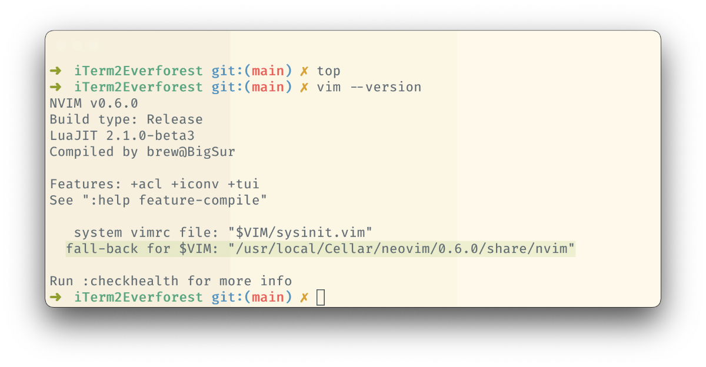

[Everforest](https://github.com/sainnhe/everforest) color theme for iTerm2. Both dark and light themes have three variations: hard, medium, and soft contrast.

### Dark

### Light 

### Install
Download any of the theme files on your local filesystem. Then go to the `iTerm2 -> Preferences -> Profiles tab`. Select your profile or create a new one. Head to the `Colors` tab in the profile settings and in the lower right corner click on a select box and pick "Import...". Once the theme is imported it will appear in this select box so you can pick it.
